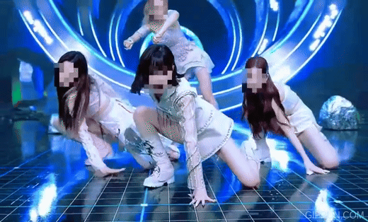

# **Mosaic treatment of a person's face with OpenCV**
---

**This code is a simple face mosaic program that uses OpenCV to detect faces in video files and mosaic the detected face area to play video.**

 Recognize and mosaic people's faces with OpenCV and Python only
The project was inspired by a crime against portrait rights infringement on the Internet. 

 [DIP Daegu Big Data Utilization Center] (https://www.youtube.com/watch?v=HtrNQfK-XyE) ) 
We were inspired.

## ** Key Points - Describe the key steps**
---
1. Library Import:
   
*i. cv2: a module for using the opencv library.*

3. Initialize video files and face detectors:    
  *i. video_file: The path of the video file to be processed.*    
* ii. cap: Open a video file using cv2.VideoCapture and initialize the capture object.*
*iii. face_cascade: Initializes the Haar Cascade classifier for face detection.*         

3. Video frame processing loop:                
  *i. while(cap.isOpen()): Repeated processing each frame of the video over an infinite loop.*         

4. Read the frame:               
  *i. ret, frame = cap.read(): Read the following frame from the video capture object, and 
     return the success or failure of the frame itself.*
* ii. faces = face_cascade.detectMultiScale(gray, scaleFactor=1.1, minNeighbors=5, minSize= 
    (30, 30)): Haar Cascade*         
   
5. Apply a mosaic face to the frame:                
  *i. Replace the original face area with a mosaicized area.*           

6. Video Play and Termination Conditions:           
  *i. cv2.imshow ('Video', frame): Display the processed frames on the screen.*
* ii. cv2.waitKey(50) & 0xFF == order('q'): Waiting for keyboard input, press 'q' to end 
     loop.*          
   
7. Resource release:            
  *i. cap.release(): Release the video capture object.*
 *ii. cv2.destroyAllWindows(): Close all open windows.*            

***The code detects the face in real time from the video, and mosaic the detected face. To exit, press the 'q' key.***

## **Requirements: (with versions i tested on)**
---
1. python (3.7.3)
2. opencv (4.1.0)

## **Results**
---
 There are cases where the code don't recognize many people, and when the video is fast, code don't recognize them well. However, We think we can get closer to perfection if we supplement the results a little.          

         

## **The limitations**
---
1. Restrictions on face sizing: The current code is sizing to mosaic your face, but this can cause your face to become too small. When mosaic small faces, facial features can be lost and difficult to recognize.

2. Absence of Different Facial Feature Processing: The code simply mosaic the detected face, so it does not preserve the face's various features. More sophisticated processing techniques may be needed to improve facial recognition.

3. Absence of various detection and tracking algorithms: Only one Haar Cascade classifier is used in the code. A combination of different detection and tracking algorithms can help obtain more accurate results.
